# HealthTwin AI — Architecture & AI Decision Flow Diagrams

All diagrams are rendered with Mermaid. Every node is derived directly from the actual source code.

---

## 1. System Architecture Overview

High-level view of every major layer — frontend, backend, AI spine, database, and external services.

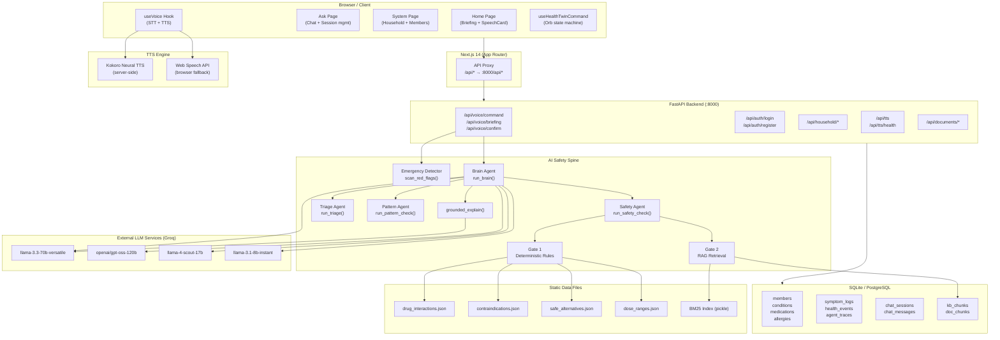
```mermaid
graph TB
    subgraph Browser["Browser / Client"]
        UI_HOME["Home Page\n(Briefing + SpeechCard)"]
        UI_ASK["Ask Page\n(Chat + Session mgmt)"]
        UI_SYSTEM["System Page\n(Household + Members)"]
        VOICE_HOOK["useVoice Hook\n(STT + TTS)"]
        CMD_HOOK["useHealthTwinCommand\n(Orb state machine)"]
    end

    subgraph NextJS["Next.js 14 (App Router)"]
        PROXY["API Proxy\n/api/* → :8000/api/*"]
    end

    subgraph FastAPI["FastAPI Backend (:8000)"]
        R_VOICE["/api/voice/command\n/api/voice/briefing\n/api/voice/confirm"]
        R_AUTH["/api/auth/login\n/api/auth/register"]
        R_HOUSEHOLD["/api/household/*"]
        R_TTS["/api/tts\n/api/tts/health"]
        R_DOCS["/api/documents/*"]
    end

    subgraph AISpine["AI Safety Spine"]
        EMERGENCY["Emergency Detector\nscan_red_flags()"]
        BRAIN["Brain Agent\nrun_brain()"]
        SAFETY["Safety Agent\nrun_safety_check()"]
        TRIAGE["Triage Agent\nrun_triage()"]
        PATTERN["Pattern Agent\nrun_pattern_check()"]
        GATE1["Gate 1\nDeterministic Rules"]
        GATE2["Gate 2\nRAG Retrieval"]
        GROUNDED["grounded_explain()"]
    end

    subgraph LLMServices["External LLM Services (Groq)"]
        LLM1["llama-3.3-70b-versatile"]
        LLM2["openai/gpt-oss-120b"]
        LLM3["llama-4-scout-17b"]
        LLM4["llama-3.1-8b-instant"]
    end

    subgraph TTS["TTS Engine"]
        KOKORO["Kokoro Neural TTS\n(server-side)"]
        WEBSPEECH["Web Speech API\n(browser fallback)"]
    end

    subgraph Database["SQLite / PostgreSQL"]
        DB_MEMBERS["members\nconditions\nmedications\nallergies"]
        DB_LOGS["symptom_logs\nhealth_events\nagent_traces"]
        DB_CHAT["chat_sessions\nchat_messages"]
        DB_KB["kb_chunks\ndoc_chunks"]
    end

    subgraph DataFiles["Static Data Files"]
        JSON_DI["drug_interactions.json"]
        JSON_CI["contraindications.json"]
        JSON_SA["safe_alternatives.json"]
        JSON_DR["dose_ranges.json"]
        BM25["BM25 Index (pickle)"]
    end

    Browser --> PROXY --> FastAPI
    VOICE_HOOK --> KOKORO
    VOICE_HOOK --> WEBSPEECH
    R_VOICE --> EMERGENCY
    R_VOICE --> BRAIN
    BRAIN --> SAFETY
    BRAIN --> TRIAGE
    BRAIN --> PATTERN
    BRAIN --> GROUNDED
    SAFETY --> GATE1
    SAFETY --> GATE2
    GATE1 --> JSON_DI & JSON_CI & JSON_SA & JSON_DR
    GATE2 --> BM25
    BRAIN --> LLM1 & LLM2 & LLM3 & LLM4
    GROUNDED --> LLM1
    FastAPI --> Database
    GATE2 --> DB_KB
```

---

## 2. Voice Command End-to-End Sequence

Complete request-response cycle from user speaking to audio output.

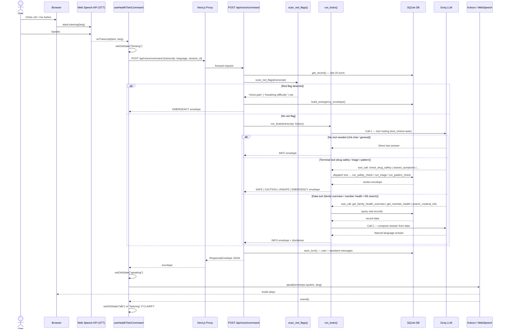
```mermaid
sequenceDiagram
    actor User
    participant Browser
    participant STT as Web Speech API (STT)
    participant Hook as useHealthTwinCommand
    participant Proxy as Next.js Proxy
    participant API as POST /api/voice/command
    participant Emergency as scan_red_flags()
    participant Brain as run_brain()
    participant DB as SQLite DB
    participant LLM as Groq LLM
    participant TTS as Kokoro / WebSpeech

    User->>Browser: Clicks orb / mic button
    Browser->>STT: startListening(lang)
    User->>STT: Speaks
    STT-->>Hook: onTranscript(text, lang)
    Hook->>Hook: setOrbState("thinking")
    Hook->>Proxy: POST /api/voice/command {transcript, language, session_id}
    Proxy->>API: forward request

    API->>DB: get_recent() — last 20 turns
    API->>Emergency: scan_red_flags(transcript)
    alt Red flag detected
        Emergency-->>API: "chest pain" | "breathing difficulty" | etc.
        API->>DB: build_emergency_envelope()
        API-->>Hook: EMERGENCY envelope
    else No red flag
        API->>Brain: run_brain(transcript, history)
        Brain->>LLM: Call 1 — tool routing (tool_choice=auto)
        alt No tool needed (chit-chat / general)
            LLM-->>Brain: Direct text answer
            Brain-->>API: INFO envelope
        else Terminal tool (drug safety / triage / pattern)
            LLM-->>Brain: tool_call: check_drug_safety | assess_symptoms | …
            Brain->>DB: dispatch tool → run_safety_check / run_triage / run_pattern_check
            DB-->>Brain: verdict envelope
            Brain-->>API: SAFE | CAUTION | UNSAFE | EMERGENCY envelope
        else Data tool (family overview / member health / KB search)
            LLM-->>Brain: tool_call: get_family_health_overview | get_member_health | search_medical_info
            Brain->>DB: query real records
            DB-->>Brain: record data
            Brain->>LLM: Call 2 — compose answer from data
            LLM-->>Brain: Natural language answer
            Brain-->>API: INFO envelope + disclaimer
        end
    end

    API->>DB: save_turn() — user + assistant messages
    API-->>Proxy: ResponseEnvelope JSON
    Proxy-->>Hook: envelope

    Hook->>Hook: setOrbState("speaking")
    Hook->>TTS: speak(envelope.spoken, lang)
    TTS-->>Browser: Audio plays
    TTS-->>Hook: onend()
    Hook->>Hook: setOrbState("idle") or "listening" if CLARIFY
```

---

## 3. Emergency Detection Flow

Emergency detection runs **before** any NLU or LLM call — deterministic regex, ~5 ms latency.

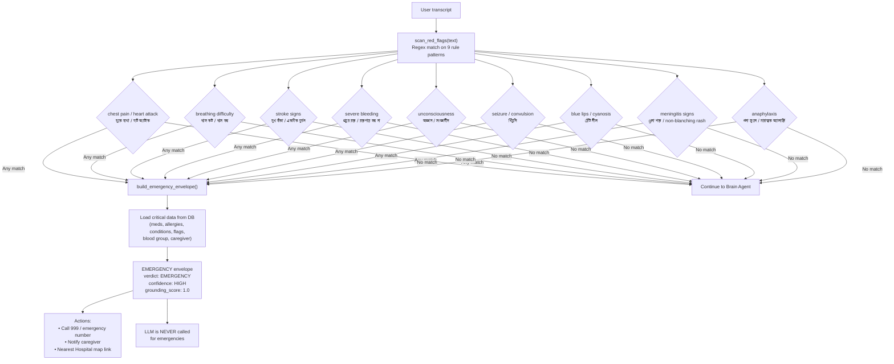
```mermaid
flowchart TD
    INPUT["User transcript"] --> SCAN["scan_red_flags(text)\nRegex match on 9 rule patterns"]

    SCAN --> R1{"chest pain / heart attack\nবুকে ব্যথা / হার্ট অ্যাটাক"}
    SCAN --> R2{"breathing difficulty\nশ্বাস কষ্ট / শ্বাস বন্ধ"}
    SCAN --> R3{"stroke signs\nমুখ বাঁকা / একদিক দুর্বল"}
    SCAN --> R4{"severe bleeding\nপ্রচুর রক্ত / রক্তপাত বন্ধ না"}
    SCAN --> R5{"unconsciousness\nঅজ্ঞান / সংজ্ঞাহীন"}
    SCAN --> R6{"seizure / convulsion\nখিঁচুনি"}
    SCAN --> R7{"blue lips / cyanosis\nঠোঁট নীল"}
    SCAN --> R8{"meningitis signs\ngলা শক্ত / non-blanching rash"}
    SCAN --> R9{"anaphylaxis\nগলা ফুলে / মারাত্মক অ্যালার্জি"}

    R1 & R2 & R3 & R4 & R5 & R6 & R7 & R8 & R9 -->|Any match| BUILD["build_emergency_envelope()"]
    R1 & R2 & R3 & R4 & R5 & R6 & R7 & R8 & R9 -->|No match| CONTINUE["Continue to Brain Agent"]

    BUILD --> FETCH_CRITICAL["Load critical data from DB\n(meds, allergies, conditions, flags,\nblood group, caregiver)"]
    FETCH_CRITICAL --> ENV["EMERGENCY envelope\nverdict: EMERGENCY\nconfidence: HIGH\ngrounding_score: 1.0"]
    ENV --> ACTIONS["Actions:\n• Call 999 / emergency number\n• Notify caregiver\n• Nearest Hospital map link"]
    ENV --> SKIP_LLM["LLM is NEVER called\nfor emergencies"]
```

---

## 4. Drug Safety Check — Three-Gate Pipeline

Gate 1 is always deterministic. Gate 2 (RAG) runs only for SAFE verdicts. Gate 3 (NLI) is disabled on the demo host to avoid OOM.

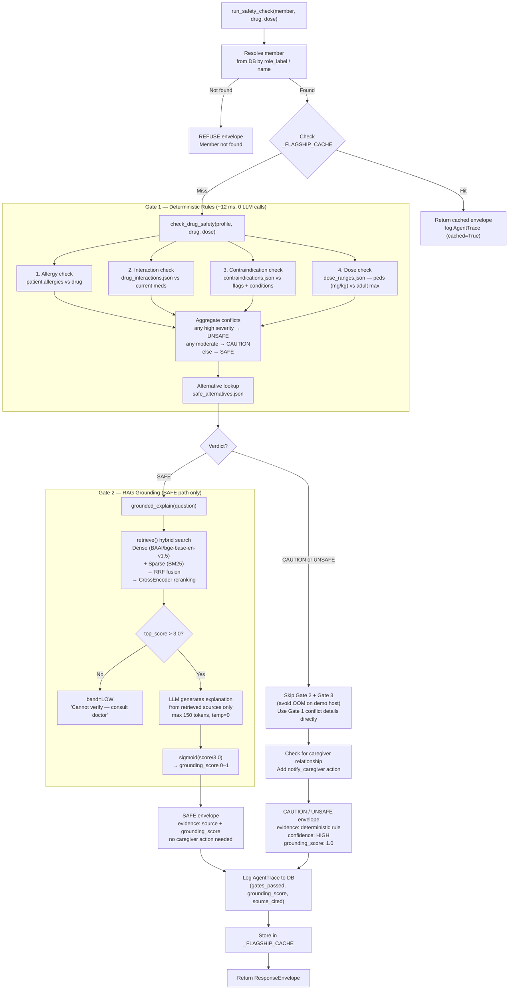
```mermaid
flowchart TD
    START["run_safety_check(member, drug, dose)"]

    START --> RESOLVE["Resolve member\nfrom DB by role_label / name"]
    RESOLVE -->|Not found| REFUSE["REFUSE envelope\nMember not found"]
    RESOLVE -->|Found| CACHE{"Check\n_FLAGSHIP_CACHE"}
    CACHE -->|Hit| CACHED_RETURN["Return cached envelope\nlog AgentTrace (cached=True)"]
    CACHE -->|Miss| GATE1

    subgraph Gate1["Gate 1 — Deterministic Rules (~12 ms, 0 LLM calls)"]
        GATE1["check_drug_safety(profile, drug, dose)"]
        GATE1 --> A1["1. Allergy check\npatient.allergies vs drug"]
        GATE1 --> A2["2. Interaction check\ndrug_interactions.json vs current meds"]
        GATE1 --> A3["3. Contraindication check\ncontraindications.json vs flags + conditions"]
        GATE1 --> A4["4. Dose check\ndose_ranges.json — peds (mg/kg) vs adult max"]
        A1 & A2 & A3 & A4 --> VERDICT_AGG["Aggregate conflicts\nany high severity → UNSAFE\nany moderate → CAUTION\nelse → SAFE"]
        VERDICT_AGG --> ALT["Alternative lookup\nsafe_alternatives.json"]
    end

    ALT --> VERDICT_BRANCH{Verdict?}

    VERDICT_BRANCH -->|SAFE| GATE2

    subgraph Gate2["Gate 2 — RAG Grounding (SAFE path only)"]
        GATE2["grounded_explain(question)"]
        GATE2 --> RETRIEVE["retrieve() hybrid search\nDense (BAAI/bge-base-en-v1.5)\n+ Sparse (BM25)\n→ RRF fusion\n→ CrossEncoder reranking"]
        RETRIEVE --> SCORE{"top_score > 3.0?"}
        SCORE -->|No| LOW_BAND["band=LOW\n'Cannot verify — consult doctor'"]
        SCORE -->|Yes| GENERATE["LLM generates explanation\nfrom retrieved sources only\nmax 150 tokens, temp=0"]
        GENERATE --> GROUNDING_SCORE["sigmoid(score/3.0)\n→ grounding_score 0–1"]
    end

    GROUNDING_SCORE --> SAFE_ENV["SAFE envelope\nevidence: source + grounding_score\nno caregiver action needed"]

    VERDICT_BRANCH -->|CAUTION or UNSAFE| SKIP_GATE2["Skip Gate 2 + Gate 3\n(avoid OOM on demo host)\nUse Gate 1 conflict details directly"]
    SKIP_GATE2 --> CAREGIVER["Check for caregiver relationship\nAdd notify_caregiver action"]
    CAREGIVER --> UNSAFE_ENV["CAUTION / UNSAFE envelope\nevidence: deterministic rule\nconfidence: HIGH\ngrounding_score: 1.0"]

    SAFE_ENV & UNSAFE_ENV --> LOG["Log AgentTrace to DB\n(gates_passed, grounding_score, source_cited)"]
    LOG --> STORE_CACHE["Store in _FLAGSHIP_CACHE"]
    STORE_CACHE --> RETURN["Return ResponseEnvelope"]
```

---

## 5. Triage Agent — Symptom Urgency Classification

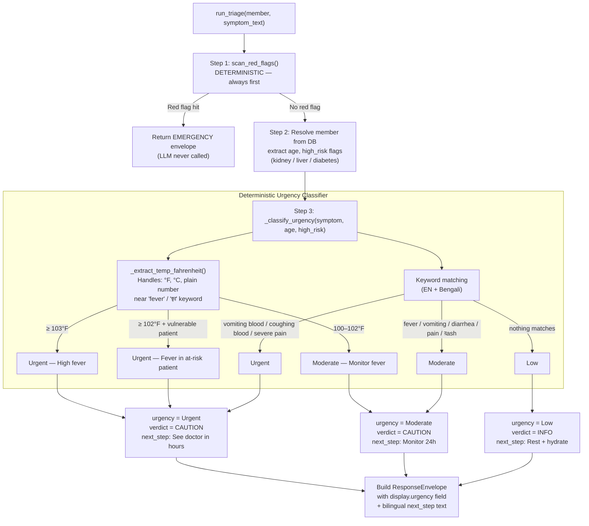
```mermaid
flowchart TD
    START["run_triage(member, symptom_text)"]

    START --> STEP1["Step 1: scan_red_flags()\nDETERMINISTIC — always first"]
    STEP1 -->|Red flag hit| EMERGENCY_RETURN["Return EMERGENCY envelope\n(LLM never called)"]
    STEP1 -->|No red flag| STEP2["Step 2: Resolve member from DB\nextract age, high_risk flags\n(kidney / liver / diabetes)"]

    STEP2 --> STEP3["Step 3: _classify_urgency(symptom, age, high_risk)"]

    subgraph Classifier["Deterministic Urgency Classifier"]
        STEP3 --> TEMP["_extract_temp_fahrenheit()\nHandles: °F, °C, plain number\nnear 'fever' / 'জ্বর' keyword"]
        TEMP -->|≥ 103°F| URGENT_FEVER["Urgent — High fever"]
        TEMP -->|≥ 102°F + vulnerable patient| URGENT_VULN["Urgent — Fever in at-risk patient"]
        TEMP -->|100–102°F| MOD_FEVER["Moderate — Monitor fever"]

        STEP3 --> KEYWORDS["Keyword matching\n(EN + Bengali)"]
        KEYWORDS -->|vomiting blood / coughing blood / severe pain| URGENT_KW["Urgent"]
        KEYWORDS -->|fever / vomiting / diarrhea / pain / রash| MOD_KW["Moderate"]
        KEYWORDS -->|nothing matches| LOW["Low"]
    end

    URGENT_FEVER & URGENT_VULN & URGENT_KW --> URGENCY_U["urgency = Urgent\nverdict = CAUTION\nnext_step: See doctor in hours"]
    MOD_FEVER & MOD_KW --> URGENCY_M["urgency = Moderate\nverdict = CAUTION\nnext_step: Monitor 24h"]
    LOW --> URGENCY_L["urgency = Low\nverdict = INFO\nnext_step: Rest + hydrate"]

    URGENCY_U & URGENCY_M & URGENCY_L --> ENVELOPE["Build ResponseEnvelope\nwith display.urgency field\n+ bilingual next_step text"]
```

---

## 6. Brain Agent — LLM Tool-Calling Flow

The brain uses at most 2 LLM calls per turn and never invents medical data.

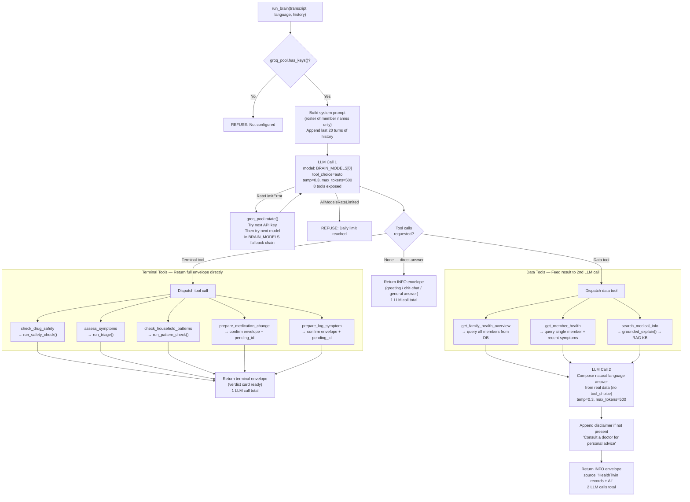
```mermaid
flowchart TD
    START["run_brain(transcript, language, history)"]

    START --> CHECK_KEY{"groq_pool.has_keys()?"}
    CHECK_KEY -->|No| NOT_CONFIGURED["REFUSE: Not configured"]
    CHECK_KEY -->|Yes| BUILD_SYSTEM["Build system prompt\n(roster of member names only)\nAppend last 20 turns of history"]

    BUILD_SYSTEM --> CALL1["LLM Call 1\nmodel: BRAIN_MODELS[0]\ntool_choice=auto\ntemp=0.3, max_tokens=500\n8 tools exposed"]

    CALL1 -->|RateLimitError| ROTATE["groq_pool.rotate()\nTry next API key\nThen try next model\nin BRAIN_MODELS fallback chain"]
    ROTATE --> CALL1
    CALL1 -->|AllModelsRateLimited| DAILY_LIMIT["REFUSE: Daily limit reached"]

    CALL1 --> TOOL_BRANCH{"Tool calls\nrequested?"}

    TOOL_BRANCH -->|None — direct answer| DIRECT["Return INFO envelope\n(greeting / chit-chat / general answer)\n1 LLM call total"]

    TOOL_BRANCH -->|Terminal tool| TERMINAL_DISPATCH

    subgraph TerminalTools["Terminal Tools — Return full envelope directly"]
        TERMINAL_DISPATCH["Dispatch tool call"]
        TERMINAL_DISPATCH --> T1["check_drug_safety\n→ run_safety_check()"]
        TERMINAL_DISPATCH --> T2["assess_symptoms\n→ run_triage()"]
        TERMINAL_DISPATCH --> T3["check_household_patterns\n→ run_pattern_check()"]
        TERMINAL_DISPATCH --> T4["prepare_medication_change\n→ confirm envelope + pending_id"]
        TERMINAL_DISPATCH --> T5["prepare_log_symptom\n→ confirm envelope + pending_id"]
    end

    T1 & T2 & T3 & T4 & T5 --> TERMINAL_RETURN["Return terminal envelope\n(verdict card ready)\n1 LLM call total"]

    TOOL_BRANCH -->|Data tool| DATA_DISPATCH

    subgraph DataTools["Data Tools — Feed result to 2nd LLM call"]
        DATA_DISPATCH["Dispatch data tool"]
        DATA_DISPATCH --> D1["get_family_health_overview\n→ query all members from DB"]
        DATA_DISPATCH --> D2["get_member_health\n→ query single member + recent symptoms"]
        DATA_DISPATCH --> D3["search_medical_info\n→ grounded_explain() → RAG KB"]
    end

    D1 & D2 & D3 --> CALL2["LLM Call 2\nCompose natural language answer\nfrom real data (no tool_choice)\ntemp=0.3, max_tokens=500"]
    CALL2 --> ADD_DISCLAIMER["Append disclaimer if not present\n'Consult a doctor for personal advice'"]
    ADD_DISCLAIMER --> INFO_ENV["Return INFO envelope\nsource: 'HealthTwin records + AI'\n2 LLM calls total"]
```

---

## 7. Model Fallback Chain & API Key Rotation

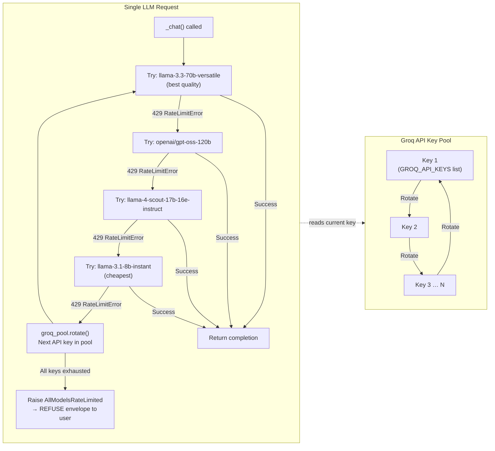
```mermaid
flowchart LR
    subgraph Request["Single LLM Request"]
        direction TB
        START_REQ["_chat() called"]
        START_REQ --> M1["Try: llama-3.3-70b-versatile\n(best quality)"]
        M1 -->|429 RateLimitError| M2["Try: openai/gpt-oss-120b"]
        M2 -->|429 RateLimitError| M3["Try: llama-4-scout-17b-16e-instruct"]
        M3 -->|429 RateLimitError| M4["Try: llama-3.1-8b-instant\n(cheapest)"]
        M4 -->|429 RateLimitError| KEY_ROTATE["groq_pool.rotate()\nNext API key in pool"]
        KEY_ROTATE --> M1
        M1 & M2 & M3 & M4 -->|Success| RESPONSE["Return completion"]
        KEY_ROTATE -->|All keys exhausted| ALL_LIMITED["Raise AllModelsRateLimited\n→ REFUSE envelope to user"]
    end

    subgraph Pool["Groq API Key Pool"]
        K1["Key 1\n(GROQ_API_KEYS list)"]
        K2["Key 2"]
        K3["Key 3 … N"]
        K1 -->|Rotate| K2 -->|Rotate| K3 -->|Rotate| K1
    end

    Request -.->|reads current key| Pool
```

---

## 8. Gate 2 — RAG Retrieval Pipeline

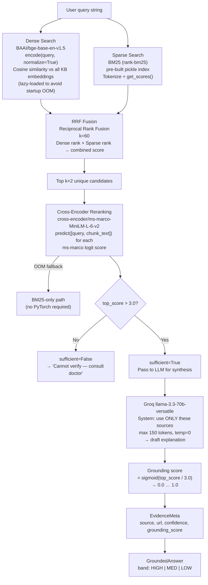
```mermaid
flowchart TD
    QUERY["User query string"]

    QUERY --> DENSE["Dense Search\nBAAI/bge-base-en-v1.5\nencode(query, normalize=True)\nCosine similarity vs all KB embeddings\n(lazy-loaded to avoid startup OOM)"]

    QUERY --> SPARSE["Sparse Search\nBM25 (rank-bm25)\npre-built pickle index\nTokenize + get_scores()"]

    DENSE --> RRF["RRF Fusion\nReciprocal Rank Fusion\nk=60\nDense rank + Sparse rank → combined score"]
    SPARSE --> RRF

    RRF --> CANDIDATES["Top k×2 unique candidates"]

    CANDIDATES --> RERANK["Cross-Encoder Reranking\ncross-encoder/ms-marco-MiniLM-L-6-v2\npredict([query, chunk_text]) for each\nms-marco logit score"]

    RERANK -->|OOM fallback| BM25_ONLY["BM25-only path\n(no PyTorch required)"]

    RERANK --> THRESHOLD{"top_score > 3.0?"}
    THRESHOLD -->|No| INSUFFICIENT["sufficient=False\n→ 'Cannot verify — consult doctor'"]
    THRESHOLD -->|Yes| SUFFICIENT["sufficient=True\nPass to LLM for synthesis"]

    SUFFICIENT --> LLM_SYNTH["Groq llama-3.3-70b-versatile\nSystem: use ONLY these sources\nmax 150 tokens, temp=0\n→ draft explanation"]

    LLM_SYNTH --> SCORE_MAP["Grounding score\n= sigmoid(top_score / 3.0)\n→ 0.0 … 1.0"]

    SCORE_MAP --> EVIDENCE["EvidenceMeta\nsource, url, confidence, grounding_score"]
    EVIDENCE --> GROUNDED_ANSWER["GroundedAnswer\nband: HIGH | MED | LOW"]
```

---

## 9. Pattern Detection Flow

Detects household-level clusters and hereditary risks — fully deterministic, no LLM.

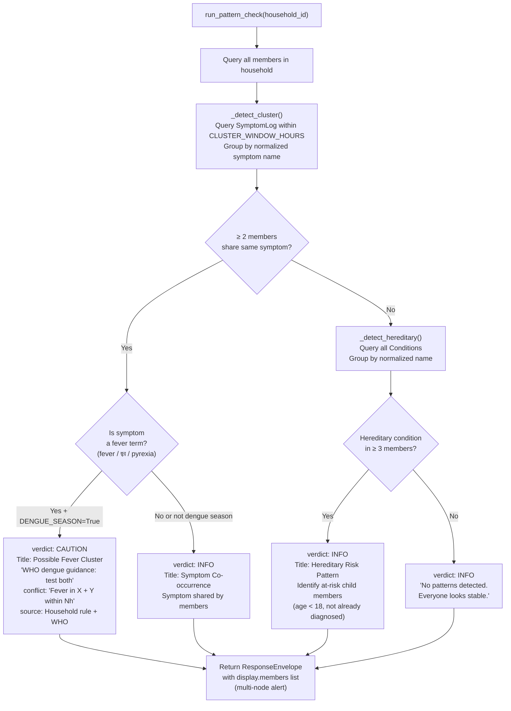
```mermaid
flowchart TD
    START["run_pattern_check(household_id)"]

    START --> FETCH_MEMBERS["Query all members in household"]
    FETCH_MEMBERS --> CLUSTER["_detect_cluster()\nQuery SymptomLog within CLUSTER_WINDOW_HOURS\nGroup by normalized symptom name"]

    CLUSTER --> CLUSTER_CHECK{"≥ 2 members\nshare same symptom?"}
    CLUSTER_CHECK -->|No| HEREDITARY["_detect_hereditary()\nQuery all Conditions\nGroup by normalized name"]
    CLUSTER_CHECK -->|Yes| IS_FEVER{"Is symptom\na fever term?\n(fever / জ্বর / pyrexia)"}

    IS_FEVER -->|Yes + DENGUE_SEASON=True| DENGUE_ALERT["verdict: CAUTION\nTitle: Possible Fever Cluster\n'WHO dengue guidance: test both'\nconflict: 'Fever in X + Y within Nh'\nsource: Household rule + WHO"]

    IS_FEVER -->|No or not dengue season| CO_OCCUR["verdict: INFO\nTitle: Symptom Co-occurrence\nSymptom shared by members"]

    HEREDITARY --> HEREDITARY_CHECK{"Hereditary condition\nin ≥ 3 members?"}
    HEREDITARY_CHECK -->|No| NO_PATTERN["verdict: INFO\n'No patterns detected.\nEveryone looks stable.'"]
    HEREDITARY_CHECK -->|Yes| HEREDITARY_ALERT["verdict: INFO\nTitle: Hereditary Risk Pattern\nIdentify at-risk child members\n(age < 18, not already diagnosed)"]

    DENGUE_ALERT & CO_OCCUR & HEREDITARY_ALERT & NO_PATTERN --> ENVELOPE["Return ResponseEnvelope\nwith display.members list\n(multi-node alert)"]
```

---

## 10. TTS Audio Pipeline

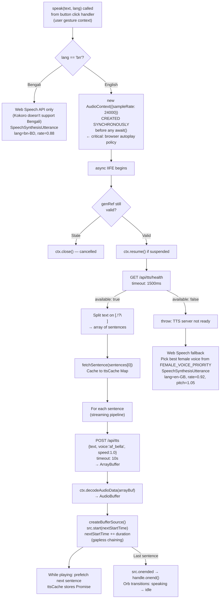
```mermaid
flowchart TD
    SPEAK["speak(text, lang) called\nfrom button click handler\n(user gesture context)"]

    SPEAK --> LANG_CHECK{"lang == 'bn'?"}

    LANG_CHECK -->|Bengali| WEB_SPEECH_BN["Web Speech API only\n(Kokoro doesn't support Bengali)\nSpeechSynthesisUtterance\nlang=bn-BD, rate=0.88"]

    LANG_CHECK -->|English| CTX_CREATE["new AudioContext({sampleRate: 24000})\nCREATED SYNCHRONOUSLY\nbefore any await()\n← critical: browser autoplay policy"]

    CTX_CREATE --> ASYNC_IIFE["async IIFE begins"]
    ASYNC_IIFE --> GEN_CHECK{"genRef still\nvalid?"}
    GEN_CHECK -->|Stale| CLOSE_CTX["ctx.close() — cancelled"]

    GEN_CHECK -->|Valid| RESUME["ctx.resume() if suspended"]
    RESUME --> HEALTH_PROBE["GET /api/tts/health\ntimeout: 1500ms"]

    HEALTH_PROBE -->|available: false| THROW["throw: TTS server not ready"]
    HEALTH_PROBE -->|available: true| SENTENCE_SPLIT["Split text on [.!?\\n]\n→ array of sentences"]

    SENTENCE_SPLIT --> PRELOAD["fetchSentence(sentences[0])\nCache to ttsCache Map<string, Promise>"]
    PRELOAD --> PIPELINE_LOOP["For each sentence\n(streaming pipeline)"]

    PIPELINE_LOOP --> FETCH_SENTENCE["POST /api/tts\n{text, voice:'af_bella', speed:1.0}\ntimeout: 10s\n→ ArrayBuffer"]

    FETCH_SENTENCE --> DECODE["ctx.decodeAudioData(arrayBuf)\n→ AudioBuffer"]
    DECODE --> SCHEDULE["createBufferSource()\nsrc.start(nextStartTime)\nnextStartTime += duration\n(gapless chaining)"]

    SCHEDULE --> PREFETCH["While playing: prefetch next sentence\nttsCache stores Promise<ArrayBuffer>"]

    SCHEDULE -->|Last sentence| ON_END["src.onended → handle.onend()\nOrb transitions: speaking → idle"]

    THROW --> WEB_FALLBACK["Web Speech fallback\nPick best female voice from FEMALE_VOICE_PRIORITY\nSpeechSynthesisUtterance\nlang=en-GB, rate=0.92, pitch=1.05"]
```

---

## 11. Database Entity Relationship Diagram

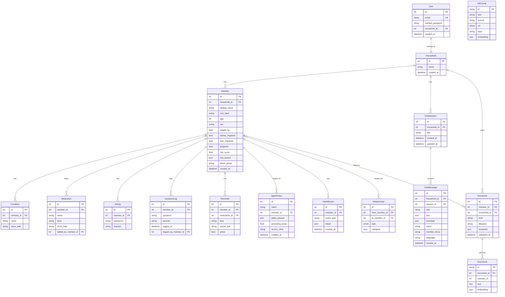
```mermaid
erDiagram
    User {
        int id PK
        string email UK
        string hashed_password
        int household_id FK
        datetime created_at
    }

    Household {
        int id PK
        string name
        datetime created_at
    }

    Member {
        int id PK
        int household_id FK
        string display_name
        string role_label
        int age
        string sex
        float weight_kg
        bool kidney_impaired
        bool liver_impaired
        bool pregnant
        float risk_score
        json risk_factors
        string blood_group
        datetime created_at
    }

    Condition {
        int id PK
        int member_id FK
        string name
        string since_date
    }

    Medication {
        int id PK
        int member_id FK
        string name
        string dose
        string since_date
        int added_by_member_id FK
    }

    Allergy {
        int id PK
        int member_id FK
        string substance
        string reaction
    }

    SymptomLog {
        int id PK
        int member_id FK
        string symptom
        string severity
        datetime logged_at
        int logged_by_member_id FK
    }

    Relationship {
        int id PK
        int from_member_id FK
        int to_member_id FK
        enum type
        bool caregiver
    }

    Reminder {
        int id PK
        int member_id FK
        int medication_id FK
        string time
        string repeat_rule
        bool active
    }

    AgentTrace {
        int id PK
        string intent
        int member_id FK
        json gates_passed
        float grounding_score
        string source_cited
        datetime created_at
    }

    KBChunk {
        string id PK
        string text
        string source
        string url
        string topic
        json embedding
    }

    ChatSession {
        int id PK
        int household_id FK
        string title
        datetime created_at
        datetime updated_at
    }

    ChatMessage {
        int id PK
        int household_id FK
        int session_id FK
        string role
        text text
        json envelope
        string intent
        string member_focus
        string language
        datetime created_at
    }

    HealthEvent {
        int id PK
        int member_id FK
        string event_type
        json detail
        datetime created_at
    }

    Document {
        int id PK
        int member_id FK
        int household_id FK
        string kind
        string filename
        json extracted
        datetime uploaded_at
    }

    DocChunk {
        string id PK
        int document_id FK
        int member_id
        text text
        json embedding
    }

    User ||--|| Household : "belongs to"
    Household ||--o{ Member : "has"
    Member ||--o{ Condition : "has"
    Member ||--o{ Medication : "takes"
    Member ||--o{ Allergy : "has"
    Member ||--o{ SymptomLog : "logs"
    Member ||--o{ Reminder : "has"
    Member ||--o{ AgentTrace : "subject of"
    Member ||--o{ HealthEvent : "has"
    Member }o--o{ Relationship : "related via"
    Household ||--o{ ChatSession : "has"
    ChatSession ||--o{ ChatMessage : "contains"
    Household ||--o{ Document : "owns"
    Document ||--o{ DocChunk : "split into"
    Member ||--o{ Document : "linked to"
```

---

## 12. ResponseEnvelope — Data Model

Every API response from HealthTwin is a single `ResponseEnvelope` object.

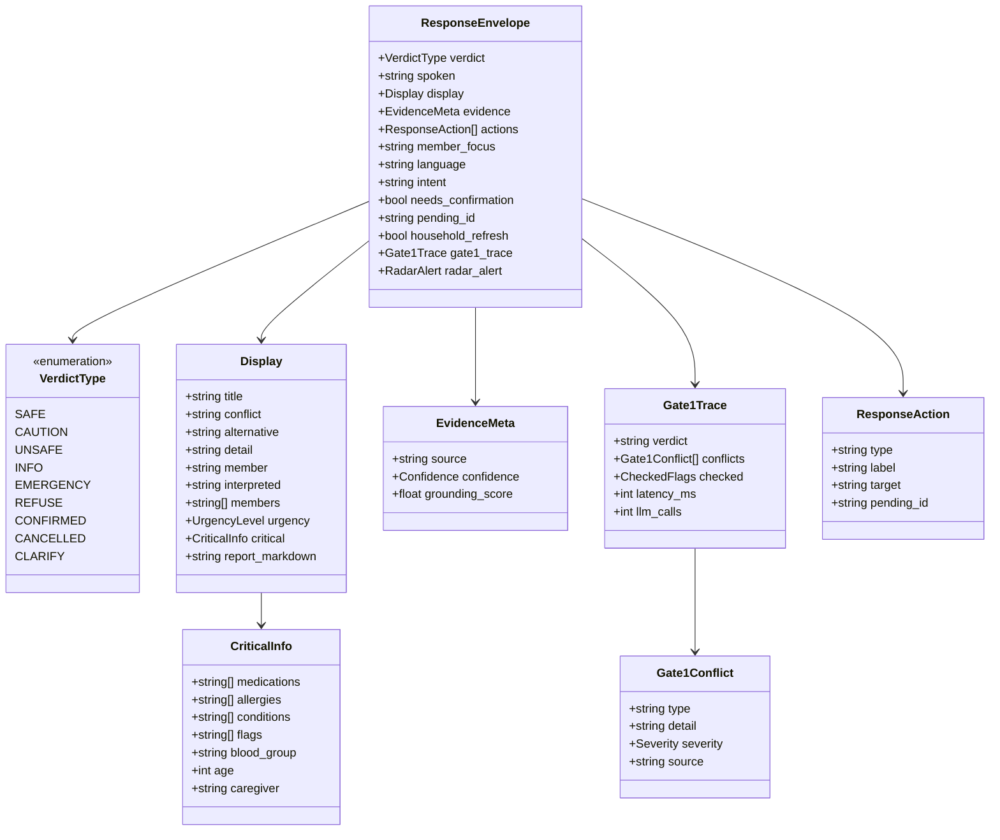
```mermaid
classDiagram
    class ResponseEnvelope {
        +VerdictType verdict
        +string spoken
        +Display display
        +EvidenceMeta evidence
        +ResponseAction[] actions
        +string member_focus
        +string language
        +string intent
        +bool needs_confirmation
        +string pending_id
        +bool household_refresh
        +Gate1Trace gate1_trace
        +RadarAlert radar_alert
    }

    class VerdictType {
        <<enumeration>>
        SAFE
        CAUTION
        UNSAFE
        INFO
        EMERGENCY
        REFUSE
        CONFIRMED
        CANCELLED
        CLARIFY
    }

    class Display {
        +string title
        +string conflict
        +string alternative
        +string detail
        +string member
        +string interpreted
        +string[] members
        +UrgencyLevel urgency
        +CriticalInfo critical
        +string report_markdown
    }

    class EvidenceMeta {
        +string source
        +Confidence confidence
        +float grounding_score
    }

    class Gate1Trace {
        +string verdict
        +Gate1Conflict[] conflicts
        +CheckedFlags checked
        +int latency_ms
        +int llm_calls
    }

    class Gate1Conflict {
        +string type
        +string detail
        +Severity severity
        +string source
    }

    class CriticalInfo {
        +string[] medications
        +string[] allergies
        +string[] conditions
        +string[] flags
        +string blood_group
        +int age
        +string caregiver
    }

    class ResponseAction {
        +string type
        +string label
        +string target
        +string pending_id
    }

    ResponseEnvelope --> VerdictType
    ResponseEnvelope --> Display
    ResponseEnvelope --> EvidenceMeta
    ResponseEnvelope --> Gate1Trace
    ResponseEnvelope --> ResponseAction
    Display --> CriticalInfo
    Gate1Trace --> Gate1Conflict
```

---

## 13. Confirm-Before-Write Flow

Write operations (add/remove medication, log symptom) always require explicit user confirmation.

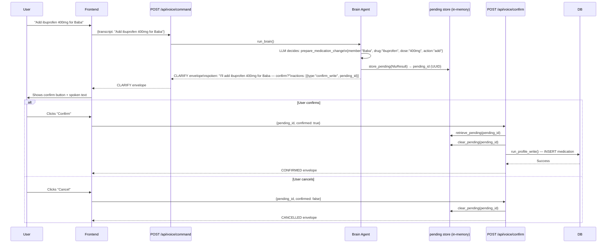
```mermaid
sequenceDiagram
    participant User
    participant Frontend
    participant API_CMD as POST /api/voice/command
    participant Brain as Brain Agent
    participant Pending as pending store (in-memory)
    participant API_CONFIRM as POST /api/voice/confirm
    participant DB

    User->>Frontend: "Add ibuprofen 400mg for Baba"
    Frontend->>API_CMD: {transcript: "Add ibuprofen 400mg for Baba"}
    API_CMD->>Brain: run_brain()
    Brain->>Brain: LLM decides: prepare_medication_change\n{member:"Baba", drug:"ibuprofen", dose:"400mg", action:"add"}
    Brain->>Pending: store_pending(NluResult) → pending_id (UUID)
    Brain-->>API_CMD: CLARIFY envelope\nspoken: "I'll add ibuprofen 400mg for Baba — confirm?"\nactions: [{type:"confirm_write", pending_id}]
    API_CMD-->>Frontend: CLARIFY envelope
    Frontend->>User: Shows confirm button + spoken text

    alt User confirms
        User->>Frontend: Clicks "Confirm"
        Frontend->>API_CONFIRM: {pending_id, confirmed: true}
        API_CONFIRM->>Pending: retrieve_pending(pending_id)
        API_CONFIRM->>Pending: clear_pending(pending_id)
        API_CONFIRM->>DB: run_profile_write() — INSERT medication
        DB-->>API_CONFIRM: Success
        API_CONFIRM-->>Frontend: CONFIRMED envelope
    else User cancels
        User->>Frontend: Clicks "Cancel"
        Frontend->>API_CONFIRM: {pending_id, confirmed: false}
        API_CONFIRM->>Pending: clear_pending(pending_id)
        API_CONFIRM-->>Frontend: CANCELLED envelope
    end
```

---

## 14. API Route Map

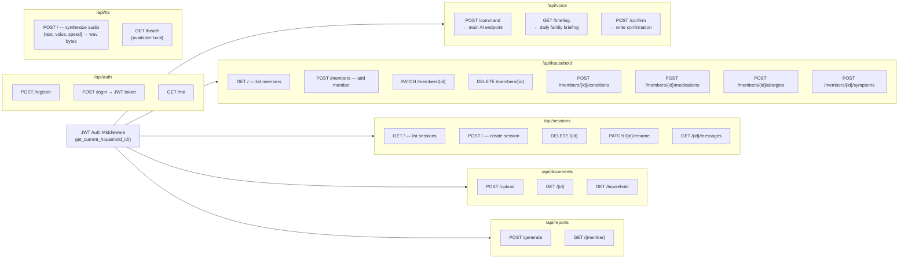
```mermaid
graph LR
    subgraph Auth["/api/auth"]
        A1["POST /register"]
        A2["POST /login → JWT token"]
        A3["GET /me"]
    end

    subgraph Voice["/api/voice"]
        V1["POST /command\n← main AI endpoint"]
        V2["GET /briefing\n← daily family briefing"]
        V3["POST /confirm\n← write confirmation"]
    end

    subgraph Household["/api/household"]
        H1["GET / — list members"]
        H2["POST /members — add member"]
        H3["PATCH /members/{id}"]
        H4["DELETE /members/{id}"]
        H5["POST /members/{id}/conditions"]
        H6["POST /members/{id}/medications"]
        H7["POST /members/{id}/allergies"]
        H8["POST /members/{id}/symptoms"]
    end

    subgraph TTS["/api/tts"]
        T1["POST / — synthesize audio\n{text, voice, speed} → wav bytes"]
        T2["GET /health\n{available: bool}"]
    end

    subgraph Sessions["/api/sessions"]
        S1["GET / — list sessions"]
        S2["POST / — create session"]
        S3["DELETE /{id}"]
        S4["PATCH /{id}/rename"]
        S5["GET /{id}/messages"]
    end

    subgraph Docs["/api/documents"]
        D1["POST /upload"]
        D2["GET /{id}"]
        D3["GET /household"]
    end

    subgraph Reports["/api/reports"]
        R1["POST /generate"]
        R2["GET /{member}"]
    end

    AUTH_MIDDLEWARE["JWT Auth Middleware\nget_current_household_id()"] --> Voice & Household & Sessions & Docs & Reports
```

---

## 15. Frontend Component Hierarchy

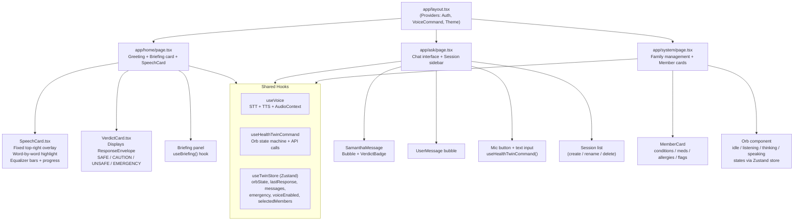
```mermaid
graph TD
    ROOT["app/layout.tsx\n(Providers: Auth, VoiceCommand, Theme)"]

    ROOT --> HOME["app/home/page.tsx\nGreeting + Briefing card + SpeechCard"]
    ROOT --> ASK["app/ask/page.tsx\nChat interface + Session sidebar"]
    ROOT --> SYSTEM["app/system/page.tsx\nFamily management + Member cards"]

    HOME --> SPEECH_CARD["SpeechCard.tsx\nFixed top-right overlay\nWord-by-word highlight\nEqualizer bars + progress"]
    HOME --> VERDICT_CARD["VerdictCard.tsx\nDisplays ResponseEnvelope\nSAFE / CAUTION / UNSAFE / EMERGENCY"]
    HOME --> BRIEFING["Briefing panel\nuseBriefing() hook"]

    ASK --> SAMANTHA_MSG["SamanthaMessage\nBubble + VerdictBadge"]
    ASK --> USER_MSG["UserMessage bubble"]
    ASK --> CHAT_INPUT["Mic button + text input\nuseHealthTwinCommand()"]
    ASK --> SESSION_SIDEBAR["Session list\n(create / rename / delete)"]

    SYSTEM --> MEMBER_CARD["MemberCard\nconditions / meds / allergies / flags"]
    SYSTEM --> ORB["Orb component\nidle / listening / thinking / speaking\nstates via Zustand store"]

    subgraph Hooks["Shared Hooks"]
        H1["useVoice\nSTT + TTS + AudioContext"]
        H2["useHealthTwinCommand\nOrb state machine + API calls"]
        H3["useTwinStore (Zustand)\norbState, lastResponse, messages,\nemergency, voiceEnabled, selectedMembers"]
    end

    HOME & ASK & SYSTEM --> Hooks
```

---

## 16. Orb State Machine

The orb is the central UI affordance — its state drives both visual feedback and voice pipeline transitions.

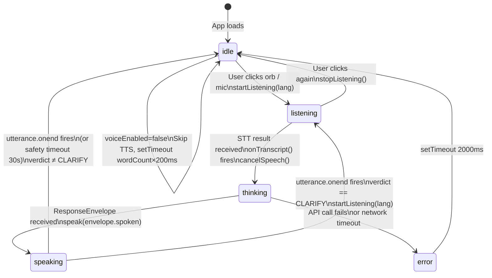
```mermaid
stateDiagram-v2
    [*] --> idle : App loads

    idle --> listening : User clicks orb / mic\nstartListening(lang)

    listening --> idle : User clicks again\nstopListening()
    listening --> thinking : STT result received\nonTranscript() fires\ncancelSpeech()

    thinking --> speaking : ResponseEnvelope received\nspeak(envelope.spoken)
    thinking --> error : API call fails\nor network timeout

    speaking --> idle : utterance.onend fires\n(or safety timeout 30s)\nverdict ≠ CLARIFY
    speaking --> listening : utterance.onend fires\nverdict == CLARIFY\nstartListening(lang)

    error --> idle : setTimeout 2000ms

    idle --> idle : voiceEnabled=false\nSkip TTS, setTimeout wordCount×200ms
```

---

## 17. Language Detection & Routing

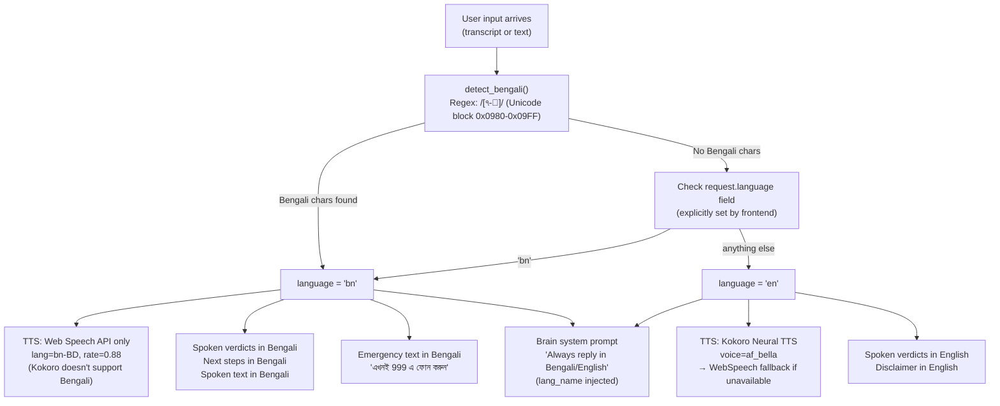
```mermaid
flowchart TD
    INPUT["User input arrives\n(transcript or text)"]

    INPUT --> DETECT_BN["detect_bengali()\nRegex: /[ঀ-৿]/ (Unicode block 0x0980-0x09FF)"]

    DETECT_BN -->|Bengali chars found| BN["language = 'bn'"]
    DETECT_BN -->|No Bengali chars| CHECK_LANG["Check request.language field\n(explicitly set by frontend)"]
    CHECK_LANG -->|'bn'| BN
    CHECK_LANG -->|anything else| EN["language = 'en'"]

    BN --> BN_TTS["TTS: Web Speech API only\nlang=bn-BD, rate=0.88\n(Kokoro doesn't support Bengali)"]
    BN --> BN_VERDICTS["Spoken verdicts in Bengali\nNext steps in Bengali\nSpoken text in Bengali"]
    BN --> BN_EMERGENCY["Emergency text in Bengali\n'এখনই 999 এ ফোন করুন'"]

    EN --> EN_TTS["TTS: Kokoro Neural TTS\nvoice=af_bella\n→ WebSpeech fallback if unavailable"]
    EN --> EN_VERDICTS["Spoken verdicts in English\nDisclaimer in English"]

    BN & EN --> BRAIN_PROMPT["Brain system prompt\n'Always reply in Bengali/English'\n(lang_name injected)"]
```

---

## 18. Verdict Decision Tree — All Possible Outcomes

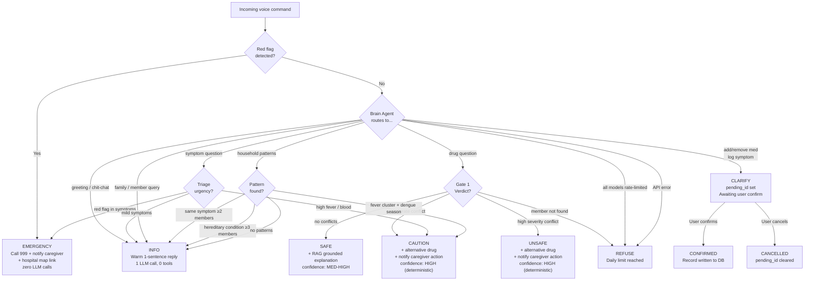
```mermaid
flowchart TD
    REQUEST["Incoming voice command"]

    REQUEST --> RED_FLAG{"Red flag\ndetected?"}
    RED_FLAG -->|Yes| EMERGENCY["EMERGENCY\nCall 999 + notify caregiver\n+ hospital map link\nzero LLM calls"]

    RED_FLAG -->|No| BRAIN_ROUTE{"Brain Agent\nroutes to..."}

    BRAIN_ROUTE -->|"greeting / chit-chat"| INFO["INFO\nWarm 1-sentence reply\n1 LLM call, 0 tools"]

    BRAIN_ROUTE -->|drug question| DRUG_SAFETY{"Gate 1\nVerdict?"}
    DRUG_SAFETY -->|"no conflicts"| SAFE["SAFE\n+ RAG grounded explanation\nconfidence: MED-HIGH"]
    DRUG_SAFETY -->|"moderate conflict"| CAUTION["CAUTION\n+ alternative drug\n+ notify caregiver action\nconfidence: HIGH (deterministic)"]
    DRUG_SAFETY -->|"high severity conflict"| UNSAFE["UNSAFE\n+ alternative drug\n+ notify caregiver action\nconfidence: HIGH (deterministic)"]
    DRUG_SAFETY -->|"member not found"| REFUSE["REFUSE\nMember not found"]

    BRAIN_ROUTE -->|symptom question| TRIAGE_ROUTE{"Triage\nurgency?"}
    TRIAGE_ROUTE -->|"red flag in symptoms"| EMERGENCY
    TRIAGE_ROUTE -->|"high fever / blood"| CAUTION
    TRIAGE_ROUTE -->|"mild symptoms"| INFO

    BRAIN_ROUTE -->|"add/remove med\nlog symptom"| CLARIFY["CLARIFY\npending_id set\nAwaiting user confirm"]
    CLARIFY -->|"User confirms"| CONFIRMED["CONFIRMED\nRecord written to DB"]
    CLARIFY -->|"User cancels"| CANCELLED["CANCELLED\npending_id cleared"]

    BRAIN_ROUTE -->|"family / member query"| INFO
    BRAIN_ROUTE -->|"household patterns"| PATTERN_ROUTE{"Pattern\nfound?"}
    PATTERN_ROUTE -->|"fever cluster + dengue season"| CAUTION
    PATTERN_ROUTE -->|"same symptom ≥2 members"| INFO
    PATTERN_ROUTE -->|"hereditary condition ≥3 members"| INFO
    PATTERN_ROUTE -->|"no patterns"| INFO

    BRAIN_ROUTE -->|"all models rate-limited"| REFUSE["REFUSE\nDaily limit reached"]
    BRAIN_ROUTE -->|"API error"| REFUSE
```

---

## 19. Chat Session & Memory Persistence

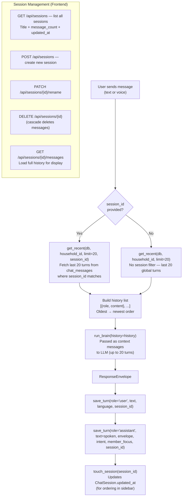
```mermaid
flowchart TD
    USER_MSG["User sends message\n(text or voice)"]

    USER_MSG --> SESSION_CHECK{"session_id\nprovided?"}
    SESSION_CHECK -->|Yes| FETCH_HISTORY["get_recent(db, household_id, limit=20, session_id)\nFetch last 20 turns from chat_messages\nwhere session_id matches"]
    SESSION_CHECK -->|No| FETCH_GLOBAL["get_recent(db, household_id, limit=20)\nNo session filter — last 20 global turns"]

    FETCH_HISTORY & FETCH_GLOBAL --> BUILD_HISTORY["Build history list\n[{role, content}, ...]\nOldest → newest order"]

    BUILD_HISTORY --> BRAIN["run_brain(history=history)\nPassed as context messages\nto LLM (up to 20 turns)"]

    BRAIN --> RESPONSE["ResponseEnvelope"]
    RESPONSE --> SAVE_USER["save_turn(role='user', text, language, session_id)"]
    SAVE_USER --> SAVE_ASST["save_turn(role='assistant', text=spoken, envelope, intent, member_focus, session_id)"]

    SAVE_ASST --> TOUCH_SESSION["touch_session(session_id)\nUpdates ChatSession.updated_at\n(for ordering in sidebar)"]

    subgraph SessionMgmt["Session Management (Frontend)"]
        SL["GET /api/sessions — list all sessions\nTitle + message_count + updated_at"]
        SC["POST /api/sessions — create new session"]
        SR["PATCH /api/sessions/{id}/rename"]
        SD["DELETE /api/sessions/{id}\n(cascade deletes messages)"]
        SM["GET /api/sessions/{id}/messages\nLoad full history for display"]
    end
```

---

## 20. AgentTrace Audit Log

Every AI decision is logged — full auditability with zero trust in unlogged responses.

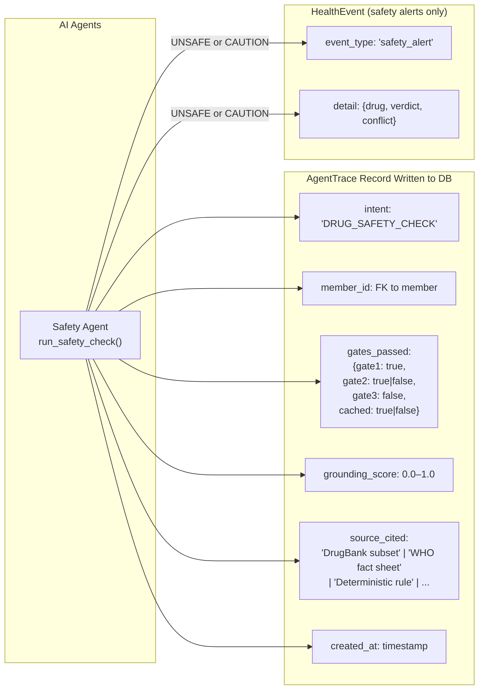
```mermaid
flowchart LR
    subgraph Agents["AI Agents"]
        SA["Safety Agent\nrun_safety_check()"]
    end

    subgraph TraceData["AgentTrace Record Written to DB"]
        INTENT["intent: 'DRUG_SAFETY_CHECK'"]
        MEMBER["member_id: FK to member"]
        GATES["gates_passed:\n{gate1: true,\n gate2: true|false,\n gate3: false,\n cached: true|false}"]
        SCORE["grounding_score: 0.0–1.0"]
        SOURCE["source_cited:\n'DrugBank subset' | 'WHO fact sheet'\n| 'Deterministic rule' | ..."]
        TS["created_at: timestamp"]
    end

    subgraph Events["HealthEvent (safety alerts only)"]
        EVT_TYPE["event_type: 'safety_alert'"]
        EVT_DETAIL["detail: {drug, verdict, conflict}"]
    end

    SA --> INTENT & MEMBER & GATES & SCORE & SOURCE & TS
    SA -->|UNSAFE or CAUTION| EVT_TYPE & EVT_DETAIL
```

---

## 21. Document Upload & RAG Pipeline

```mermaid
flowchart TD
    UPLOAD["POST /api/documents/upload\n{file, member_id, kind}"]

    UPLOAD --> OCR["OCR / text extraction\n(future: Tesseract / LLM vision)"]
    OCR --> CHUNK["Split into DocChunks\n(overlapping windows)"]
    CHUNK --> EMBED["Embed each chunk\nBAAI/bge-base-en-v1.5\n→ DocChunk.embedding (JSON)"]
    EMBED --> STORE_CHUNKS["INSERT DocChunk rows\nlinked to Document + Member"]

    STORE_CHUNKS --> QUERY["User asks question about their records"]
    QUERY --> DOC_RETRIEVE["retrieve_docs(question, member_id, db)\nDense similarity search\nover member's own DocChunks"]
    DOC_RETRIEVE --> SUFFICIENT{"sufficient?"}
    SUFFICIENT -->|No| KB_FALLBACK["Fall back to global KB\nretrieve(question, k=3)"]
    SUFFICIENT -->|Yes| USE_DOC["Use document chunks\nas context for grounded_explain()"]
    KB_FALLBACK --> USE_KB["Use KB chunks\nas context for grounded_explain()"]
```

---

## 22. Daily Briefing Generation Flow

```mermaid
flowchart TD
    TRIGGER["GET /api/voice/briefing\n(called on Home page load)"]

    TRIGGER --> FETCH_ALL["Query all Members\nwith medications, conditions, allergies\n(joinedload — single query)"]

    FETCH_ALL --> EMPTY{"No members?"}
    EMPTY -->|Yes| EMPTY_MSG["INFO envelope\n'Add your family to get started'"]
    EMPTY -->|No| WATCH_FLAGS["Compute watch_flags\nFor each member:\n• kidney_impaired → 'avoid NSAIDs'\n• liver_impaired → 'check dosing'\n• allergies → 'allergy to X'"]

    WATCH_FLAGS --> PATTERN_RUN["run_pattern_check(db, household_id)\nCheck symptom clusters + hereditary"]

    PATTERN_RUN --> BUILD_SPOKEN["Build spoken text:\n'Family briefing: N members, M meds.\nWatch flags: ...\nPattern alert: ...'"]

    BUILD_SPOKEN --> BUILD_DETAIL["Build detail (markdown):\n• Member (age): med1, med2\n⚠ watch flag per member"]

    BUILD_DETAIL --> VERDICT_SELECT{"Pattern conflict\nfound?"}
    VERDICT_SELECT -->|Yes| CAUTION_BRIEF["verdict: CAUTION\nconflict: pattern_conflict text"]
    VERDICT_SELECT -->|No| INFO_BRIEF["verdict: INFO"]

    CAUTION_BRIEF & INFO_BRIEF --> RETURN["Return ResponseEnvelope\nHome page speaks it via Samantha\nSpeechCard shows word-by-word"]
```

---

## 23. SpeechCard Animation State

```mermaid
stateDiagram-v2
    [*] --> Hidden : isPlaying=false

    Hidden --> SlideIn : isPlaying=true\nAnimatePresence mounts\nspring: opacity 0→1, y -16→0, scale 0.94→1

    SlideIn --> Speaking : Animation complete

    Speaking --> Speaking : setInterval ticks every 1000/2.6ms\nsetActiveWord(idx++)\nScroll active word into view

    Speaking --> ProgressUpdate : activeWord changes\nwidth = (activeWord+1/total) × 100%\nanimation: 0.38s linear

    ProgressUpdate --> Speaking : Continue

    Speaking --> SlideOut : User clicks X\nonStop() called / isPlaying=false\nspring exit: opacity→0, y→-16, scale→0.94

    SlideOut --> Hidden : AnimatePresence unmounts

    Speaking --> Complete : All words exhausted\nclearInterval\nsetActiveWord stays at last word

    Complete --> SlideOut : isPlaying set to false\n(handle.onend → clearTimeout → setIsPlaying(false))
```

---

## 24. Security & Auth Flow

```mermaid
sequenceDiagram
    participant Browser
    participant Next as Next.js Proxy
    participant Auth as /api/auth
    participant Protected as Protected Routes
    participant DB

    Browser->>Auth: POST /api/auth/register\n{email, password, household_name}
    Auth->>DB: Hash password (bcrypt)\nINSERT User + Household
    Auth-->>Browser: {access_token: JWT}

    Browser->>Auth: POST /api/auth/login\n{email, password}
    Auth->>DB: Lookup User by email
    Auth->>Auth: verify_password(plain, hashed)
    Auth-->>Browser: {access_token: JWT, household_id}
    Browser->>Browser: Store token in localStorage

    Browser->>Next: POST /api/voice/command\nAuthorization: Bearer <token>
    Next->>Protected: Forward with token
    Protected->>Protected: get_current_household_id()\ndecode JWT → household_id
    Protected-->>Browser: 401 if invalid/expired

    note over Browser,DB: All protected routes\nextract household_id from JWT\nData is fully tenant-isolated\nby household_id filter on every DB query
```

---

*Diagrams generated from source code analysis of: `backend/app/agents/`, `backend/app/spine/`, `backend/app/graph/models.py`, `backend/app/api/voice.py`, `frontend/hooks/`, `frontend/components/SpeechCard.tsx`, `frontend/lib/types.ts`*
