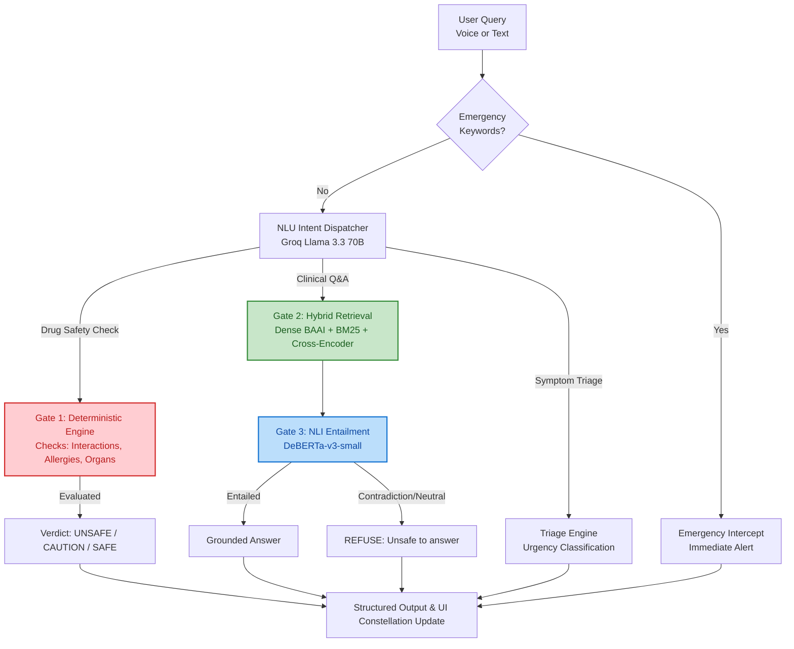

<div align="center">
  
  
  
  
  <h1>HealthTwin AI</h1>
  <h3>Voice-controlled Family Health Digital Twin</h3>
  <p><em>Official Submission for the SciBlitz AI Challenge 2026</em></p>
</div>

---

## About HealthTwin AI

HealthTwin AI is an advanced, voice-controlled **family health digital twin** powered by Large Language Models (LLMs) and Retrieval-Augmented Generation (RAG). It serves as an intelligent, bilingual medical agent that actively monitors and manages the health profiles of an entire household.

**The Vision:** Providing households with an AI agent capable of understanding complex health contexts—such as hereditary risks, ongoing medications, and localized disease outbreaks.

**The AI Innovation:** While generative AI is powerful, it can hallucinate—a fatal flaw in healthcare. HealthTwin AI bridges this gap with a novel **3-Gate Deterministic Safety Pipeline**. By combining the conversational intelligence of `Groq Llama 3.3 70B`, the semantic retrieval of cross-encoder RAG, and a strict pure-Python deterministic rule engine, the system delivers highly personalized, medical-grade safety checks. 

For example, asking *"Is ibuprofen safe for Baba?"* seamlessly cross-references Baba's digital twin data (like kidney impairment and Warfarin usage) through the deterministic AI pipeline to guarantee a 100% safe, unhallucinated verdict backed by medical evidence.

---

## Demo Family (The Rahman Household)

Explore the platform using our pre-seeded family digital twin.

| Role  | Name        | Age | Conditions                        | Medications              | Flags |
|-------|-------------|-----|-----------------------------------|--------------------------|-------|
| **Baba**  | Rahman Sr.  | 68  | Hypertension, Atrial fibrillation | Warfarin 5mg, Amlodipine | Kidney impaired |
| **Ma**    | Mrs. Rahman | 61  | Type 2 diabetes                   | Metformin 500mg          | Allergy: Penicillin |
| **Self**  | Rafiq       | 34  | —                                 | —                        | — |
| **Child** | Ayaan       | 8   | —                                 | —                        | — |

**Flagship Demo Flow:**
> **User:** *"Is ibuprofen safe for Baba?"*
> **System:** `UNSAFE` *(Reason: Warfarin + ibuprofen interaction AND kidney contraindication).*

---

## Safety Architecture & Complex Pipeline

We built a 3-Gate safety pipeline that ensures medical queries are grounded, safe, and reliable.



### The 3 Gates Explained

1. **Gate 1: Deterministic Rules (Primary Safety)**
   A pure-Python rule engine that checks drug interactions, allergies, and organ-specific contraindications using a curated subset of DrugBank and WHO guidelines. **Fully deterministic, zero hallucinations.**
2. **Gate 2: Hybrid Retrieval (Knowledge Grounding)**
   Combines Dense retrieval (`BAAI/bge-base-en-v1.5`), BM25, and Cross-Encoder reranking (`ms-marco-MiniLM-L-6-v2`) to pull accurate medical contexts from our 22-chunk WHO curated dataset.
3. **Gate 3: NLI Entailment (Hallucination Catcher)**
   A zero-shot NLI using `DeBERTa-v3-small` verifies that the LLM's final generated answer is strictly entailed by the retrieved evidence from Gate 2. If it contradicts, the system safely refuses to answer. *(Note: Disabled by default on low-RAM demo hosts, but fully implemented).*

---

## Features

- **Bilingual Voice & Text:** Natively supports both English and Bengali inputs via Web Speech API.
- **Emergency Intercept:** Detects red-flag keywords (e.g., chest pain, stroke) *before* NLU processing to guarantee immediate emergency routing.
- **Household Pattern Detection:** SQL-based analytics to detect localized outbreaks (like Dengue clusters) or hereditary risks across family members.
- **3-Column Interactive UI:** Features a Member Rail, a live Chat interface with verdict chips, and a dynamic **Constellation Twin Panel** that reacts visually to health states and verdicts.
- **Symptom Triage:** Deterministic thresholds for Urgency Classification (Emergency, Urgent, Moderate, Low).

---

## Tech Stack

| Layer | Technology |
|-------|-----------|
| **Frontend** | Next.js 14 (App Router), React, Framer Motion, Tailwind CSS |
| **Backend** | FastAPI (Python 3.11), Pydantic |
| **Database** | PostgreSQL + `pgvector` |
| **LLM / NLU** | Groq Llama 3.3 70B |
| **Retrieval (RAG)** | `sentence-transformers` BAAI/bge-base-en-v1.5 + BM25 |
| **Reranking** | `cross-encoder/ms-marco-MiniLM-L-6-v2` |
| **NLI (Gate 3)** | `microsoft/deberta-v3-small` |

---

## Setup & Installation Instructions

Follow these steps to run the complete HealthTwin AI system locally.

### 1. Database Setup (PostgreSQL + pgvector)
Ensure you have Docker installed.
```bash
docker-compose up -d
```

### 2. Backend Setup (FastAPI)
Open a new terminal window:
```bash
cd backend
python -m venv .venv

# Activate virtual environment
# On Windows:
.venv\Scripts\activate
# On macOS/Linux:
# source .venv/bin/activate

# Install dependencies
pip install -r requirements.txt

# Environment variables
cp .env.example .env
# Edit .env and add your GROQ_API_KEY

# Seed the database with the Rahman family data and symptom logs
python -m app.graph.seed

# Load and embed the WHO knowledge base into pgvector
python -m app.kb.load_corpus

# Start the backend server
uvicorn app.main:app --reload
```

### 3. Frontend Setup (Next.js)
Open another terminal window:
```bash
cd frontend
npm install
npm run dev
```

The application will be accessible at `http://localhost:3000`.

### 4. Smoke Test
You can test the core backend API directly via terminal:
```bash
curl -X POST http://localhost:8000/api/voice/command \
  -H "Content-Type: application/json" \
  -d '{"transcript": "Is ibuprofen safe for Baba?", "household_id": 1}'
```
*Expected Output: A structured JSON response with `"verdict": "UNSAFE"`.*

---

## Testing

To run the backend test suite:
```bash
cd backend
pytest tests/ -v
```
*(Note: You may see ~3 expected failures in `spine/gate3` if you are running on a Windows dev host with limited RAM causing DeBERTa OOM).*


---

<div align="center">
  <p>Built by our team for the <strong>SciBlitz AI Challenge 2026</strong>.</p>
</div>
