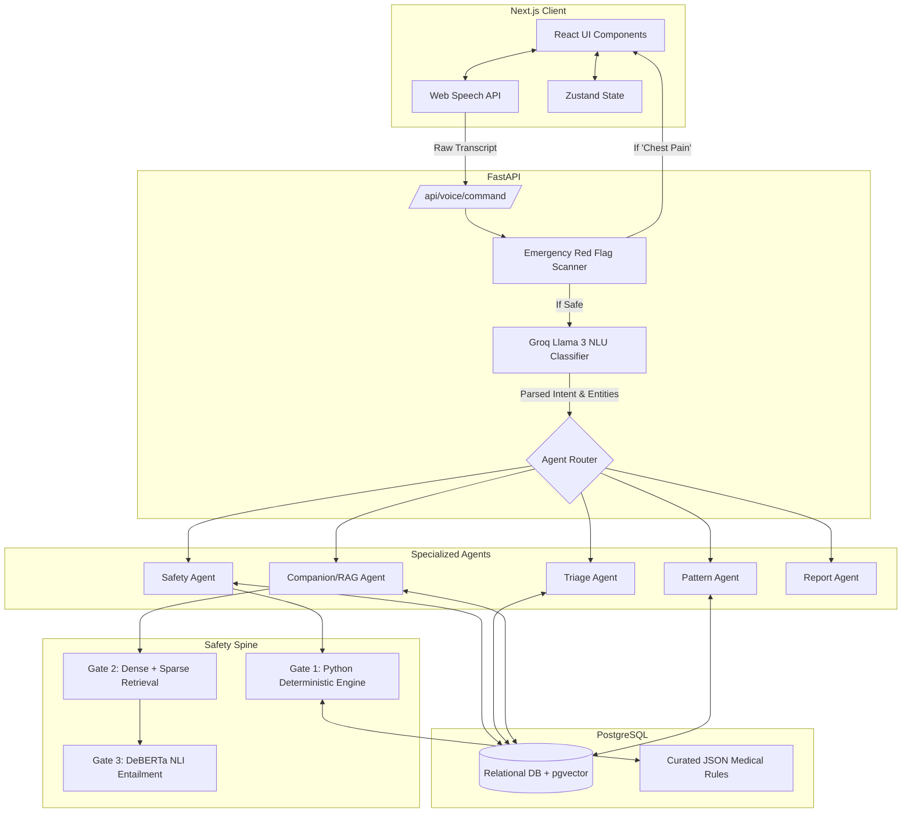
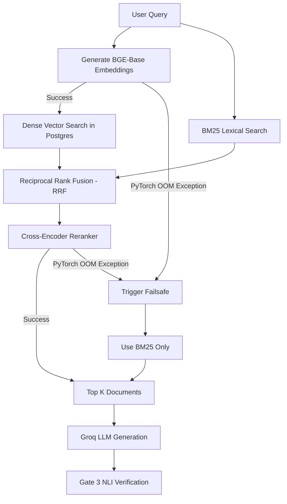
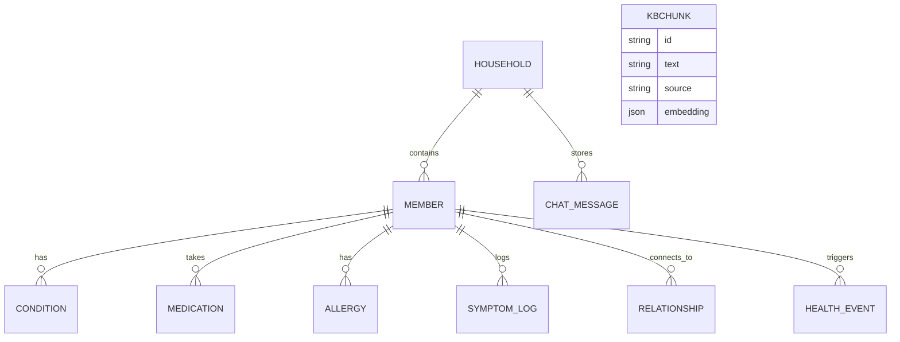

# HealthTwin AI: Comprehensive Codebase Analysis & System Design

*This document is generated strictly from a structural and logical analysis of the Python backend and Next.js frontend source code.*

---

## 1. Project Motive

The primary motive of HealthTwin AI is to provide a **hallucination-free, voice-enabled family health assistant**. 

While Large Language Models (LLMs) are excellent for parsing natural language, they are inherently unsafe for generating definitive medical advice (like drug interactions or dosage limits) because they hallucinate. HealthTwin's motive is to solve this by using the LLM **only** for Natural Language Understanding (NLU) and general conversation, while offloading all critical health decisions to a **pure deterministic rule engine** (Gate 1) and a **strictly grounded retrieval system** (Gate 2/3). 

---

## 2. What the Project Does (Core Features)

Based on the implemented agents and frontend components, the system offers the following features:

1. **Deterministic Drug Safety Checking (`SafetyAgent` / `gate1_rules.py`)**
   - Evaluates a requested medication against a specific family member's profile.
   - Checks for **Allergies** (e.g., Penicillin).
   - Checks for **Drug-Drug Interactions** (e.g., Warfarin + Ibuprofen).
   - Checks for **Contraindications** based on conditions or flags (e.g., kidney/liver impairment).
   - Checks for **Dosage Limits** (pediatric vs. adult limits).
2. **Symptom Triage (`TriageAgent`)**
   - Analyzes logged symptoms and assigns severity/urgency levels (Emergency, Urgent, Moderate, Low).
3. **Cross-Household Pattern Detection (`PatternAgent`)**
   - Scans the PostgreSQL database across all family members to find correlated health events (e.g., multiple people getting fevers could flag a Dengue outbreak).
4. **Caregiver Mapping (`CareAgent`)**
   - Manages and queries relationship trees (e.g., "Who is the primary caregiver for Baba?").
5. **Medical RAG / General Q&A (`CompanionAgent`)**
   - Answers general medical questions by fetching data from a curated Vector Database using Dense/Sparse retrieval.
6. **Automated Report Generation (`ReportAgent`)**
   - Generates downloadable Markdown reports containing medication histories, disease histories, and monthly family summaries.
7. **Emergency Intercept (`scan_red_flags`)**
   - Immediately intercepts fatal keywords (e.g., "chest pain", "stroke") at the router level and triggers an emergency UI protocol, bypassing the AI entirely.
8. **Bilingual Voice Interface (`useVoice.ts`)**
   - Supports seamless Voice-to-Text and Text-to-Voice in both English and Bengali natively in the browser.

---

## 3. All Possible Ways to Use the System

Because of the diverse intent routing in `router.py`, a user can interact with the system in the following ways:

* **Safety Verification:** *"Is Ibuprofen safe for Baba to take?"* (Triggers Gate 1 rules).
* **Logging Symptoms:** *"Log a fever for my son."* (Triggers database write with voice confirmation).
* **Triaging:** *"Ma has been having severe headaches and nausea since morning."* (Triggers Triage Agent).
* **Setting Reminders:** *"Set a reminder for Baba to take Amlodipine at 8 PM."* (Triggers reminder creation).
* **Pattern Checking:** *"Are there any unusual health patterns in the house recently?"* (Triggers Pattern Agent).
* **Family Status Overviews:** *"Give me a health status overview of all family members."* (Compiles full DB context and asks the LLM to summarize).
* **General Medical Q&A:** *"What are the standard guidelines for managing type 2 diabetes?"* (Triggers Gate 2 RAG).
* **Report Generation:** *"Generate a medication report for Baba."* (Triggers Markdown generator).
* **Document Uploading:** Users can drop physical medical documents into the `UploadDropzone` component for the system to process.

---

## 4. How the System Operates & Takes Decisions

The system is architected as an **Intent-Routed Agentic Workflow** backed by a **3-Gate Safety Spine**. 

### A. The NLU & Routing Phase
1. The user speaks into the `VoiceOrb` on the frontend.
2. The browser converts speech to text and sends it to `POST /api/voice/command`.
3. The backend uses the **Groq Llama 3.3 70B** model strictly as an NLU (Natural Language Understanding) classifier. It extracts the **Intent** (e.g., `DRUG_SAFETY_CHECK`), the **Target Member** (e.g., `Baba`), and the **Entity** (e.g., `Ibuprofen`).
4. `router.py` receives these variables and routes the execution to the correct Python agent.

### B. The Decision Making Phase (The Safety Spine)
Decisions are **never** left to the LLM's imagination.

* **For Drug/Safety Decisions (Gate 1):** 
  The system bypasses AI completely. It queries the PostgreSQL database for the target member's medical history. It then runs plain Python `if/else` logic against static, curated JSON files (`drug_interactions.json`, `contraindications.json`). If a rule is violated, it returns a hard `UNSAFE` or `CAUTION` verdict.
* **For General Medical Questions (Gate 2 & 3):**
  The system embeds the user's question and searches the PostgreSQL `pgvector` database (`KBChunk` table). It uses a hybrid search (Dense PyTorch Embeddings + Sparse BM25 Keywords) and reranks the best matches using a Cross-Encoder. The LLM is then strictly prompted to answer the question using **only** those retrieved documents.

---

## 5. System Design Diagrams

### Diagram 1: Core Architecture & Data Flow

### Diagram 2: The Fallback Retrieval (RAG) Architecture

This diagram details how the system makes decisions during Gate 2 retrieval, highlighting the failsafe mechanisms discovered in the codebase.

### Diagram 3: Database Entity Relationship (ERD)

How the system maps family members and their data.

