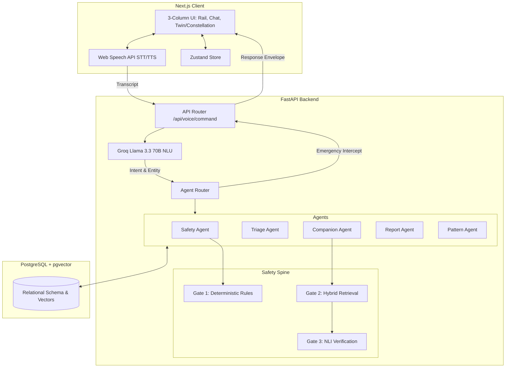
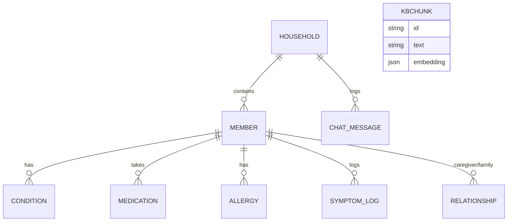

# HealthTwin AI - System Architecture Design

This document provides a comprehensive architectural overview of **HealthTwin AI**, a voice-controlled family health digital twin. This design reflects the actual implemented codebase, outlining the components, data flows, and critical design decisions.

---

## 1. Executive Summary

HealthTwin AI is a full-stack application composed of a **Next.js 14** frontend and a **FastAPI (Python 3.11)** backend. It is designed to track a family's health conditions, medications, and symptoms while providing an AI voice assistant. The core value proposition is an ultra-safe, hallucination-free medical question-answering system, enforced by a rigorous 3-Gate Safety Pipeline.

---

## 2. High-Level System Architecture

---

## 3. Frontend Architecture

The frontend is built with **Next.js 14 (App Router)** and **React**, relying on **Zustand** for state management and **Framer Motion** for animations.

### 3.1. 3-Column UI Design
The interface (`app/page.tsx`) uses a resilient, dynamic 3-column layout:
1. **Left Column (MemberRail):** An icon-only rail for quick selection of family members.
2. **Center Column (ChatPanel & VoiceOrb):** The primary interaction zone. Contains the chat history, voice recording controls, and the central animated `VoiceOrb` which reflects the system state (Idle, Listening, Thinking, Speaking).
3. **Right Column (Constellation / MemberTwin):** A visual overview of the family graph (`Constellation`) or a detailed view of a selected member (`MemberTwin`). It dynamically updates based on "Verdicts" provided by the backend.

### 3.2. State Management
`lib/store.ts` utilizes **Zustand** to maintain:
- The active household graph.
- The active member focus.
- The VoiceOrb state machine (`idle` | `listening` | `thinking` | `speaking` | `error`).
- A log of chat messages and the last received `ResponseEnvelope`.

### 3.3. Voice Integration
The application uses native browser **Web Speech API** for both Speech-to-Text (STT) and Text-to-Speech (TTS). This allows bilingual (English/Bengali) interactions without relying on expensive, high-latency cloud TTS/STT providers.

---

## 4. Backend Architecture & Agent Routing

The backend is built with **FastAPI**. It employs a routed agent architecture where user utterances are classified into intents and handled by specialized Python modules.

### 4.1. Intent Classification
Incoming text from the voice client goes through an NLU layer (powered by Groq's Llama 3.3 70B). The NLU classifies the utterance into a predefined set of intents (e.g., `DRUG_SAFETY_CHECK`, `TRIAGE_CHECK`, `LOG_SYMPTOM`, `GENERATE_REPORT`).

### 4.2. Routing Logic (`agents/router.py`)
Before routing, an **Emergency Intercept** (`scan_red_flags`) runs across the raw transcript. If red-flag words (e.g., chest pain, stroke) are detected, the system immediately short-circuits to an emergency response, bypassing standard NLU processing.

If no emergency is detected, the router maps the intent to the corresponding Agent:
- **Safety Agent:** Handles drug safety queries.
- **Triage Agent:** Analyzes symptoms and outputs urgency levels.
- **Pattern Agent:** Looks for household-wide health patterns (e.g., Dengue clusters).
- **Report Agent:** Generates markdown reports of family health.
- **Care/Companion Agent:** Handles general questions and caregiver assignments.

---

## 5. The 3-Gate Safety Pipeline (The "Spine")

This is the most critical architectural decision in the codebase. To prevent dangerous LLM hallucinations, the system uses a 3-gate pipeline.

### Gate 1: Deterministic Rules (`gate1_rules.py`)
- **How it works:** A pure-Python engine checks the requested drug against the member's profile (allergies, current meds, kidney/liver flags, age/weight).
- **Data Source:** Local curated JSON files (`drug_interactions.json`, `contraindications.json`).
- **Decision Engine:** Evaluates exact rule matches. It is completely deterministic (No LLM).
- **Output:** Returns a hard verdict of `SAFE`, `CAUTION`, or `UNSAFE`. **This is the primary safety guarantee of the system.**

### Gate 2: Hybrid Retrieval (`gate2_retrieval.py`)
- **How it works:** When answering general medical queries, it pulls facts from a curated knowledge base (WHO guidelines).
- **Mechanisms:**
  1. **Dense Retrieval:** `BAAI/bge-base-en-v1.5` semantic search.
  2. **Sparse Retrieval:** BM25 lexical search.
  3. **Fusion:** Combines dense and sparse results using Reciprocal Rank Fusion (RRF).
  4. **Reranking:** Cross-encoder reranking via `ms-marco-MiniLM-L-6-v2`.
- **Failsafe Decision:** If PyTorch goes OOM (common on low-RAM demo hosts), Gate 2 automatically falls back to a pure BM25 sparse retrieval.

### Gate 3: NLI Verification (`gate3_nli.py`)
- **How it works:** Uses Natural Language Inference (NLI) via `microsoft/deberta-v3-small`.
- **Decision Engine:** Before outputting an LLM-generated answer, it evaluates if the LLM's draft sentences are strictly entailed by the retrieved chunks from Gate 2. If the LLM fabricated information, it is stripped out.
- **Trade-off:** This is disabled on the low-RAM demo host to prevent OOM crashes, relying instead on Gate 1 for absolute safety.

---

## 6. Database Schema & Data Modeling

The system uses **PostgreSQL** with SQLAlchemy ORM and `pgvector` for vector embeddings. 

### Key Decisions in Data Modeling:
- **Member Segregation:** All conditions, medications, and allergies are tied to a `Member`, who belongs to a `Household`. This allows cross-member pattern detection (e.g., checking if an infectious symptom is spreading through the `Household`).
- **Caregiver Relationships:** The `Relationship` table allows defining directed edges between members (e.g., "Rafiq is caregiver for Baba"), powering the Care Agent.
- **KBChunks:** Medical guidelines are chunked and stored directly in the DB. `embedding` holds dense vector arrays for Gate 2 retrieval.

---

## 7. Key Architectural Decisions & Trade-offs

1. **Native Browser Voice APIs over Cloud Providers:**
   - *Decision:* Use `window.speechSynthesis` and `window.SpeechRecognition`.
   - *Reason:* Extremely low latency, zero API cost, natively supports bilingual (English/Bengali) if the OS supports it.
2. **Hardcoded Rules (Gate 1) over Prompt Engineering:**
   - *Decision:* Use standard JSON maps and Python logic for drug interactions rather than asking the LLM to evaluate safety.
   - *Reason:* LLMs are non-deterministic. A 99% accuracy rate is unacceptable for drug safety. Gate 1 provides a 100% deterministic safety guarantee.
3. **Graceful Degradation in AI Models:**
   - *Decision:* Gate 2 catches `Exception` (like OOM) on PyTorch embedding models and falls back to traditional BM25.
   - *Reason:* Keeps the system highly available even on constrained hardware environments.
4. **No Agentic Framework at Runtime:**
   - *Decision:* `agents/router.py` uses plain Python `if/elif` statements. `LangGraph` is in the requirements for the future but not used.
   - *Reason:* Explicit control flow is easier to debug, test, and guarantee safety compared to black-box autonomous agents deciding their own steps.
